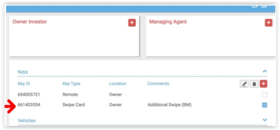

#### Additional Swipe for Resident/Managing Agent Procedure 

When some resident requests an additional swipe you must follow the below process:  

Step 1: Send the following email to the resident:  

“Good Morning/Afternoon _____,  

T**hank you for your email.** 

**In order to submit a request for an additional swipe, we will need some proof of residency. If you could please send me one of the following that would be greatly appreciated:  - Driver’s License (with the address that you are requesting the swipe for) - Utility Bill (including address)  - Tenancy Agreement/Contract of Sale (First Page)/Management Agreement** 

**Please find attached the Swipe Request Form. Once you have sent back the above Proof of Residency, I will then provide authority to the contractor. Please do not process through the payment until you have received the authority as it will be rejected.**  

**If you have any questions, please feel free to contact me and I can explain further.**  

**Kind Regards,  **

**(Name)  **

**Building Manager”** 

When sending the following email, please ensure that you CC cheryl@sarrafstrata.com.au into the emails for all Sarraf Strata sites.  

Once the resident sends back the proof of residency, you can inform them that you will provide the authority to the Strata.  

Once Sarraf confirm that the payment has been processed and provide you with a receipt you must then respond to the resident and attach the receipt. This is where you confirm the pick-up details.  Please make sure that you take a photo of the swipe prior to handing over so that you can log into the MYBOS system.  

If a resident wants you to place the swipe into their mailbox, make sure that you take a photo of you placing it in the mailbox and include the unit number on the mailbox. You will then need to send them an email and attach the photo so that we have proof that it was delivered. Please send this to resident once completed so that they know to check when they are next home.  

#### How to add an additional swipe to a resident  

Once you have handed over the swipe you then need to add this additional swipe into the MYBOS system under that specific resident. 

Please follow the below steps: 

**Step 1**: Go to the “Residents” tab on the left-hand side.  

**Step 2**: Choose the resident that you have just handed the key over too. If they are not in the lift and it is showing “Vacant/Unknown” then add them via the information that you have in the email and then send a Resident Information Request through to them to complete.  

**Step 3**: Go to the “Key” drop down and press the + sign.  

**Step 4**: Input the information that you have collected. It should look like the below screenshot.   

