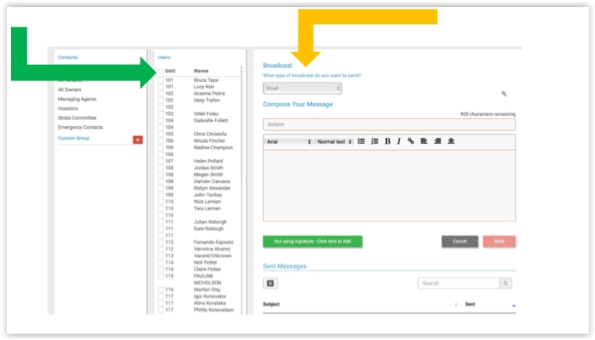

#### Broadcast Procedure 

The Broadcast feature on MYBOS is the quickest way to get information to all residents that have logged their details into the system or have provided the Building Manager with their Resident information Record.  

 If the Building Manager needs to send out a broadcast to all residents, please follow the procedure below:  

1. Log into the MYBOS Portal.  

2. Go to the site that you wish to broadcast for.  

3. Click on the Broadcast button at the top of the MYBOS site. 

4. Click the Square to include all units as shown below with the green arrow.   

5. Then select “Email” in the drop-down menu as shown with the yellow arrow. 

   

   

Once you have followed the steps above you can then continue to broadcast to the building. Please remember the label your email as below:  

**SP ___ | (ADDRESS OF PROPERTY) | (ISSUE YOU ARE EMAILING ABOUT)** 

This can be used for the following examples:  

- Lift Out of Service (Updating all residents again once the technician has attended).   
- Roller Door out of service (Updating all residents again once the technician has attended). 
- Power Outage to whole Building  
- Planned maintenance work that will block driveway  
- Planned maintenance that may cause water to cease or power to be cut off.   
- Thunder storm on the way  

The purpose is for you to try and communicate with all residents regularly and use this as a tool to provide them with as much information as possible about upcoming issues or notices that need to go out.  