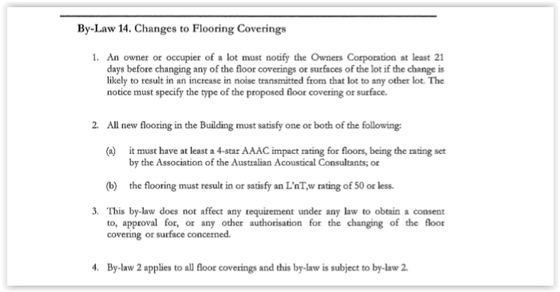

#### Installing Floorboards in Units Procedure 

If a resident phones/emails through wanting to install new floor coverings in their apartment, you must follow this procedure.  

**Step 1**: 

Check the By-Laws for the site as each building is different.  

An example of the By-law is below:  

 

 

 

**Step 2**:

 Most By-laws will state that it needs to be approved by the Strata Committee prior to going ahead.  

ALL new floor installers must have 4-star AAAC impact rating for floors, being the rating set by the association of the Australian Acoustical Consultants.  The floor must also result in or satisfy an L’nT,w Rating of 50 or less.  

**Step 3**:

 If all is to go ahead, the resident must comply with the underlay/gradient that passes the acoustic certificate. Once the resident receives this certificate then the building manager must pass this onto the Committee.  